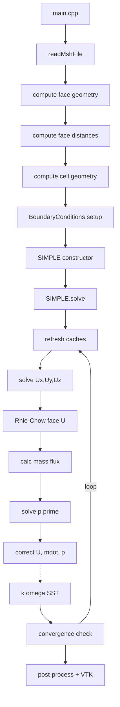

## Developer Guide

This document explains the internal architecture and implementation details of the CFD solver. It is intended for contributors and users who want to understand, extend, or debug the code.

### Table of contents
- Architecture overview
- Core data structures
- Mesh I/O and topology building
- Boundary conditions system
- Numerical schemes (gradients, convection, diffusion)
- Linear system assembly (`Matrix`)
- SIMPLE algorithm (pressure–velocity coupling)
- Rhie–Chow face-velocity interpolation
- Turbulence model (k–omega SST)
- Post-processing and VTK export
- Linear solvers
- Precision and numerical tolerances
- Extending the codebase (recipes)
- Debugging and tips

### Architecture overview (Current Structure)

**Headers (`include/`):**
- **`Core/`**: fundamental types and utilities
  - `Scalar.h`, `Vector.h`, `linearInterpolation.h`, `massFlowRate.h`
- **`Mesh/`**: geometry, fields, mesh I/O  
  - `Face.h`, `Cell.h`, `CellData.h`, `FaceData.h`, `MeshReader.h`, `checkMesh.h`
- **`BoundaryConditions/`**: patch metadata and physical BC configuration
  - `BoundaryPatch.h`, `BoundaryData.h`, `BoundaryConditions.h`
- **`Numerics/`**: discretization and algebraic system
  - `GradientScheme.h`, `ConvectionScheme.h`, `Matrix.h`, `LinearSolvers.h`, `SIMPLE.h`
- **`Models/`**: turbulence
  - `KOmegaSST.h`
- **`PostProcessing/`**: output
  - `VtkWriter.h`

**Sources (`src/`):**
- Corresponding `.cpp` implementations for all headers
- `main.cpp`: complete end-to-end example case (mesh path, BCs, schemes, solver controls, export)

## Core data structures

### Scalar precision
- `Scalar` is aliased to `double` by default via `PROJECT_USE_DOUBLE_PRECISION` (set in `CMakeLists.txt`).
- Switch to float by removing that definition. The program prints the mode via `SCALAR_MODE`.
- Global tolerances in `include/Core/Scalar.h` (e.g., `DIVISION_TOLERANCE`, `EQUALITY_TOLERANCE`, `AREA_TOLERANCE`, `VOLUME_TOLERANCE`, `GRADIENT_TOLERANCE`).

### Vector
- Simple 3D vector with arithmetic, `dot`, `cross`, `magnitude`, normalization, and stream IO.
- Used throughout for geometry (centroids, normals) and vector fields.

### Fields
- `CellData<T>`: typed cell-centered fields with bounds-checked access.
- `FaceData<T>`: typed face-centered fields.
- Type aliases:
  - `VectorField`, `ScalarField`, `VelocityField`, `PressureField`
  - `FaceFluxField` (Scalar), `FaceVectorField` (Vector)

### Mesh entities
- `Face`
  - Topology: `nodeIndices`, `ownerCell`, optional `neighbourCell` (boundary if empty).
  - Geometry computed in `calculateGeometricProperties(allNodes)`:
    - Triangles via cross product; polygons triangulated about the face center.
    - Fields: `centroid`, `normal` (unit), `area`, and integrals (`x2_integral`, ...).
  - Metric distances `calculateDistanceProperties(allCells)`:
    - `d_Pf`, `d_Nf` vectors and magnitudes; `e_Pf`, `e_Nf` unit vectors.
- `Cell`
  - Topology: lists of `faceIndices`, `neighbourCellIndices`, and `faceSigns` (outward normal convention).
  - `calculateGeometricProperties(allFaces)`:
    - Volume via divergence theorem: `V = (1/3) Σ (r_f · S_f)` using face integrals.
    - Centroid via second-moment accumulation.

## Mesh I/O and topology building

`MeshReader` reads Fluent `.msh` files (3D only):
- Sections: comments `(0)`, dimension `(2)`, nodes `(10)`, cells `(12)`, faces `(13)`, boundaries `(45)`.
- Fluent uses hexadecimal indices for declarations; helpers convert hex→dec robustly.
- Faces section returns owner and optional neighbor cell; neighbor absent implies boundary.
- Boundaries section maps `zoneID` to `BoundaryPatch` name/type via `mapFluentBCToEnum`.
- After reading:
  - Builds `Cell.faceIndices`, `Cell.faceSigns` (+1 owner, -1 neighbor), and unique `neighbourCellIndices`.
  - Validates: min faces per cell, min nodes per face; prints a summary.

Notes:
- 2D meshes are rejected early (`dimension == 2`).
- Errors throw `std::runtime_error` with descriptive messages.

## Boundary conditions system

Classes:
- `BoundaryPatch`: mesh patch metadata (name, Fluent type, `zoneID`, first/last face indices).
- `BoundaryData`: type-safe storage for value/gradient and BC type:
  - `FIXED_VALUE`, `FIXED_GRADIENT`, `ZERO_GRADIENT`, `NO_SLIP`
  - Scalars and vectors supported.
- `BoundaryConditions` (manager):
  - Collects `BoundaryPatch` instances from the reader.
  - Holds `patchBoundaryData[patchName][fieldName] = BoundaryData`.
  - Fast face→patch cache built on demand.
  - Utility getters and printers.

BC evaluation helpers used across the code:
- Scalar at boundary face: zero-gradient uses owner cell value; fixed-gradient adds `∂φ/∂n * d_n`; fixed-value returns Dirichlet value.
- Vector at boundary face: supports `NO_SLIP` (Vector 0) as a value type, zero-gradient returns owner cell vector.

## Numerical schemes

### Gradient reconstruction (`GradientScheme`)
- Cell-centered least-squares:
  - For cell P, solve normal equations for ∇φ using neighbor deltas with inverse-distance-squared weights.
  - Solves 3×3 systems with Eigen LLT, with small regularization; falls back to LU if needed.
- Face gradient interpolation:
  - Distance-weighted average of cell gradients + consistency correction along `e_PN`.
  - Used for non-orthogonal diffusion corrections and higher-order convection.

### Convection schemes (`ConvectionScheme`)
- All schemes expose `getFluxCoefficients(F, a_P_conv, a_N_conv)` for the matrix.
- Upwind (UDS): first order; stable.
- Central Difference (CDS) and Second-Order Upwind (SOU):
  - Matrix still uses upwind-like coefficients for robustness.
  - High-order accuracy added via explicit deferred-correction to the RHS.
  - CDS face value uses gradient at face; SOU uses upwind cell gradient.

### Diffusion treatment
- Orthogonal component handled implicitly via `E_f = (S_f · e) e`.
- Non-orthogonal correction handled explicitly via `T_f = S_f - E_f` and face/cell gradients.

## Linear system assembly (`Matrix`)

Holds cached gradients and face data per SIMPLE iteration:
- Cell gradients: `gradP`, `gradUx`, `gradUy`, `gradUz`, optionally `gradk`, `gradOmega`.
- Face gradients: `grad*_f` via interpolation.
- Face mass fluxes `mdotFaces` for consistent assembly.

### Momentum matrices (per component)
`buildMomentumMatrix(fieldName, φ, φ_old, source, ρ, Γ, timeScheme, dt, θ, grad_φ, grad_φ_f, conv)`:
- Steady-state path:
  - Assembles diffusion and convection for internal faces with non-orthogonal correction.
  - Boundary faces:
    - Dirichlet: contributes to diagonal and RHS using `computeDirichletValue` (handles vector-valued U components).
    - Neumann: adds to RHS for fixed-gradient; zero-gradient eliminates diffusive normal flux.
  - Deferred-correction for CDS/SOU added to RHS.
- Transient path: adds implicit diagonal `ρV/dt` and explicit old-state contributions as per θ-scheme.

### Pressure correction matrix
`buildPressureMatrix(massFlux, a_Ux, a_Uy, a_Uz, ρ)`:
- RHS is negative mass imbalance per cell.
- Coefficients derived from Rhie–Chow-consistent momentum diagonals `a_U*` and face metric/normals (minimum correction, with ρ).
- If no fixed-pressure BC exists, anchors p' at one cell to avoid singularity.

### Under-relaxation
`relax(α, φ_prev)` performs Patankar-style implicit relaxation by scaling the diagonal and adjusting RHS with the previous state.

## SIMPLE algorithm

Entry point: `SIMPLE::solve()` performs the outer iteration until convergence or `maxIterations`:
1) Cache refresh: gradients and `mdotFaces` for the current iteration.
2) Solve momentum equations for `U_x`, `U_y`, `U_z` with effective viscosity `μ_eff = μ + μ_t` (if turbulence enabled).
3) Compute Rhie–Chow face velocities and mass fluxes from updated U.
4) Build and solve pressure correction p'.
5) Correct velocity with `U = U* - (1/a_rep) ∇p'` (a representative diag per cell).
6) Correct face mass fluxes and pressure `p = p + α_p p'`; reset p'.
7) If enabled, advance k–ω SST using current fields and gradients.
8) Check convergence using mass imbalance, velocity RMS, and p' RMS; warn on divergence.

Controls:
- `setRelaxationFactors(α_U, α_p)`, `setConvergenceTolerance(tol)`, `setMaxIterations(n)`, `enableTurbulenceModeling(bool)`.

## Rhie–Chow face-velocity interpolation

Used in `calculateRhieChowFaceVelocities()` to prevent pressure checkerboarding:
- Start with linear-interpolated face velocity `U_f_lin`.
- Compute face D-like coefficient from interpolated momentum diagonals and geometry.
- Apply correction with face pressure gradient: `U_f = U_f_lin + D_f (∇p_f_lin - ∇p_f_cache)`.
- Add previous-iteration face under-relaxation term `(1-α_U)(U_f_prev - U_f_lin_prev)`.
- Boundary faces use centralized BC evaluation.

## Turbulence model (k–omega SST)

Class `KOmegaSST`:
- Initializes `k`, `ω`, `μ_t`, and computes `wallDistance` by solving a Poisson-like equation with `φ=0` at walls and `∇²φ=-1`.
- Solves ω and k transport with variable diffusion (`μ + σ·μ_t`), production/destruction, and cross-diffusion for SST.
- Calculates blending functions `F1`/`F2`, turbulent viscosity `μ_t = ρ a1 k / max(a1 ω, S F2)`, and applies wall corrections.
- Provides getters used by SIMPLE to form `μ_eff` and for post-processing: `k`, `ω`, `μ_t`, `wallDistance`, `wallShearStress`.
- Supports transient mode (`setTransientMode`), though main driver currently uses steady flow.

## Post-processing and VTK export

`VtkWriter::writeVtkFile(filename, allNodes, allFaces, allCells, scalarCellFields)`:
- Writes VTK PolyData (`.vtp`) with points and polygonal faces.
- Maps cell-centered scalar fields to faces via owner-cell index.
- Used in `main.cpp` to export pressure, velocity magnitude and components, and when available: `k`, `ω`, `μ_t`, `wallDistance`, and derived quantities (`turbulentIntensity`, `turbulentViscosityRatio`, `yPlus`).

## Linear solvers

`LinearSolvers::BiCGSTAB` wraps Eigen’s BiCGSTAB with ILUT preconditioning:
- Configurable max iterations and tolerance per solve call.
- Logs iteration counts, estimated error, and exact final residual norms (L2 and avg abs).
- Throws on non-finite errors; returns success boolean.

## Precision and numerical tolerances

- Precision selected at compile time via `PROJECT_USE_DOUBLE_PRECISION`.
- Tolerance constants adapt to `Scalar` (e.g., comparisons, divisions, gradient detection).
- Many algorithms include small epsilons to guard against degeneracy.

## Extending the codebase (recipes)

### Add a new scalar transport equation
1) Create a `ScalarField phi("phi", numCells, initial)` in your driver.
2) Build an effective diffusion field `Gamma` and a source `phi_source` per cell.
3) Use `Matrix::buildScalarTransportMatrix("phi", phi, phi_old, U, phi_source, rho, Gamma, TimeScheme::Steady, 0.0, 1.0, convScheme)`.
4) Solve with `LinearSolvers::BiCGSTAB`, copy solution back to `phi`.
5) Apply boundary conditions if needed via `BoundaryConditions`.

### Add a new convection scheme
1) Derive from `ConvectionScheme` and implement `getFluxCoefficients`.
2) Optionally add high-order face value and correction methods (see CDS/SOU) and integrate as deferred-correction in `Matrix`.

### Add a new boundary condition
1) Extend `BCType`/`BCValueType` and `BoundaryData` setters/getters.
2) Update `BoundaryConditions` evaluation for scalar/vector faces.
3) If it affects matrix assembly, update boundary handling in `Matrix`.

### Expose fluid properties as inputs
- Add setters on `SIMPLE` for `rho` and `mu`, thread through to `Matrix` and `KOmegaSST` calls as needed.

## Debugging and tips

- Use `BoundaryConditions::printSummary()` to inspect BCs.
- Enable intermediate prints (faces/cells `<<` operators) after geometry computation.
- Check solver logs: high residuals often indicate BC or relaxation issues.
- Reader throws early for malformed `.msh` files; verify indices are consistent and 3D.
- ParaView: Remember PolyData cells are faces; color by face arrays.

## Call flow

