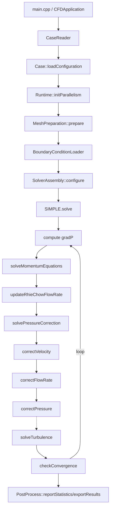

## Developer Guide

This document explains the internal architecture and implementation details of the CFD solver. It is intended for contributors and users who want to understand, extend, or debug the code.

### Table of contents
- Architecture overview
- Core data structures
- Mesh I/O and topology building
- Boundary conditions system
- Numerical schemes (gradients, convection, diffusion)
- Linear system assembly (`Matrix`)
- SIMPLE algorithm (pressure–velocity coupling)
- Rhie–Chow face-velocity interpolation
- Turbulence model (k–omega SST)
- Post-processing and VTK export
- Linear solvers
- Precision and numerical tolerances
- Extending the codebase (recipes)
- Debugging and tips

### Architecture overview (Current Structure)

Headers (`.h`) and implementations (`.cpp`) live together in the same folder under `src/`,
following the OpenFOAM convention.

- **`src/Primitives/`**: foundation types with no mesh-specific semantics
  - `Scalar.h`, `Vector.h/.cpp`, `Tensor.h/.cpp`, `OptionalRef.h`,
    `ErrorHandler.h`, `Logger.h/.cpp`
- **`src/Mesh/`**: mesh topology — geometric entities and mesh I/O
  - `BoundaryPatch.h`, `Face.h/.cpp`, `Cell.h/.cpp`, `Mesh.h`,
    `MeshReader.h/.cpp`, `MeshChecker.h/.cpp`, `MeshPreparation.h/.cpp`
- **`src/Fields/`**: typed field containers and field identity used by all layers
  - `CellData.h`, `FaceData.h`, `Field.h/.cpp`
- **`src/BoundaryConditions/`**: patch metadata and physical BC configuration
  - `BoundaryData.h/.cpp`, `BoundaryConditions.h/.cpp`,
    `BoundaryConditionLoader.h/.cpp`
- **`src/Schemes/`**: discretization schemes
  - `ConvectionSchemes.h/.cpp`, `GradientScheme.h/.cpp`, `LinearInterpolation.h`
- **`src/LinearSystem/`**: algebraic system assembly and solving
  - `Matrix.h/.cpp`, `LinearSolvers.h`, `TransportEquation.h`
- **`src/Solver/`**: SIMPLE pressure–velocity algorithm and field constraints
  - `SIMPLE.h/.cpp`, `Constraint.h/.cpp`
- **`src/Models/`**: physical models
  - `Turbulence/kOmegaSST.h/.cpp` (k–omega SST turbulence model)
- **`src/PostProcessing/`**: derived fields and output orchestration
  - `DerivedFields.h/.cpp` (velocity/vorticity magnitude, Q-criterion, strain rate)
  - `PostProcess.h/.cpp` (after-solve statistics and VTK export orchestration)
  - `VTK/VtkWriter.h/.cpp` (`.vtu` unstructured grid writer)
  - `VTK/VtkCellOrdering.h/.cpp` (internal hex/wedge/pyramid node ordering)
  - `VTK/VtkBoundaryWriter.h/.cpp` (`.vtp` wall boundary writer)
  - `VTK/PvdTimeSeries.h/.cpp` (PVD transient collection file helpers)
- **`src/Case/`**: OpenFOAM-style case file parser
  - `CaseReader.h/.cpp`, `CaseConfiguration.h/.cpp`
- **`src/Application/`**: top-level orchestration and solver assembly
  - `CFDApplication.h/.cpp`, `SolverAssembly.h/.cpp`
- **`src/main.cpp`**: command-line entry point — creates `CFDApplication` and
  starts the simulation workflow


## Core data structures

### Scalar precision
- `Scalar` is aliased to `double` by default because the CMake option
  `TURBLYZE_USE_DOUBLE_PRECISION` is `ON`; CMake then defines
  `PROJECT_USE_DOUBLE_PRECISION` for the target.
- Switch to float with `-DTURBLYZE_USE_DOUBLE_PRECISION=OFF`. The program
  prints the active mode via `SCALAR_MODE`.
- Global tolerances in `src/Primitives/Scalar.h` (e.g., `smallValue`, `vSmallValue`, `largeValue`).

### Vector
- Simple 3D vector with arithmetic, `dot`, `cross`, `magnitude`, normalization, and stream IO.
- Used throughout for geometry (centroids, normals) and vector fields.

### Fields
- `CellData<T>`: typed cell-centered fields sized from `Mesh::cellCount()`.
- `FaceData<T>`: typed face-centered fields sized from `Mesh::faceCount()`.
- Type aliases:
  - `VectorField`, `ScalarField`, `TensorField`
  - `FaceFluxField` (Scalar), `FaceVectorField` (Vector)

### Mesh entities
- `Face`
  - Topology: `nodeIndices`, `ownerCell`, optional `neighborCell` (boundary if empty).
  - Geometry computed in `calculateGeometricProperties(allNodes)`:
    - Triangles via cross product; polygons triangulated about the face center.
    - Fields: `centroid`, `normal` (unit), `projectedArea`,
      `contactArea`, and returned `FaceIntegrals` (`x2`, `y2`, `z2`,
      `volume`).
  - Metric distances `calculateDistanceProperties(cellCentroids)`:
    - `dPf`, optional `dNf`, and their stored magnitudes.
- `Cell`
  - Topology: lists of `faceIndices`, `neighborCellIndices`, and
    `faceSigns` (owner `+1`, neighbor `-1`).
  - `calculateGeometricProperties(allFaces, allFaceIntegrals)`:
    - Volume via divergence theorem: `V = (1/3) Σ (rf · Sf)` using face integrals.
    - Centroid via second-moment accumulation.


## Mesh I/O and topology building

`MeshReader` reads Fluent `.msh` files (3D only):
- Sections: comments `(0)`, dimension `(2)`, nodes `(10)`, cells `(12)`, faces `(13)`, boundaries `(45)`.
- Fluent uses hexadecimal indices for declarations; helpers convert hex→dec robustly.
- Faces section returns owner and optional neighbor cell; neighbor absent implies boundary.
- Boundaries section maps `zoneIdx` to `BoundaryPatch` name/type via `MeshReader::mapFluentBCToEnum`.
- After reading:
  - Builds `Cell.faceIndices`, `Cell.faceSigns` (+1 owner, -1 neighbor),
    and `neighborCellIndices`.
  - Validates face node counts plus owner/neighbor cell index ranges; prints
    a summary.

Notes:
- Any mesh dimension other than `3` is rejected early.
- Fatal errors route through `FatalError`, which prints source location and
  aborts the process rather than throwing exceptions.


## Boundary conditions system

### Architecture
**Classes**:
- `BoundaryPatch`: Mesh patch metadata (name, Fluent type, `zoneIdx`, first/last face indices)
- `BoundaryData`: Type-safe storage with robust value/gradient handling
- `BoundaryConditions`: Manager class with comprehensive BC operations

### BoundaryData Implementation
**Supported BC Types**:
- `fixedValue`: Dirichlet boundary conditions
- `fixedGradient`: Neumann boundary conditions
- `zeroGradient`: Natural boundary conditions
- `noSlip`: Special case for velocity (each component fixed to 0)
- `kWallFunction`: Wall function for turbulent kinetic energy
- `omegaWallFunction`: Wall function for specific dissipation rate
- `nutWallFunction`: Wall function for turbulent viscosity

**Value Storage**:
- Scalar-only — one `scalarValue_`, one `scalarGradient_`; there is no
  vector storage (velocity BCs are registered per component)
- Validated getters: `fixedScalarValue()`, `fixedScalarGradient()`

### BoundaryConditions Manager
**Data Structure**: `patchBoundaryData[patchName][field] = BoundaryData`, where `field` is the `Field` enum (`src/Fields/Field.h`: `Field::{Ux, Uy, Uz, p, pCorr, k, omega, nut}`). Field identity is a compiler-checked enum, not a string key.

**Key Features**:
1. **Direct Patch Lookup**: `Face::patch()` returns an `OptionalRef<BoundaryPatch>` linked at startup via `BoundaryConditions::linkFaces()`
2. **Per-Component Velocity BCs**: velocity has no vector BC type — it is registered as three independent scalar BCs under `Field::Ux/Uy/Uz`. `BoundaryConditionLoader` splits the case file's `U` vector at registration (`setFixedValue(patch, Field::Ux, value.x())`, etc.)
3. **Robust Retrieval**: `fieldBC()` with comprehensive error handling
4. **Boundary Value Calculation**: `boundaryFaceValue()` resolves a face value for any field — every field (`Ux`, `Uy`, `Uz`, `p`, `pCorr`, `k`, `omega`, `nut`) is scalar

### BC Evaluation Logic
**Scalar Boundary Values**:
- **fixedValue**: `φf = φBoundary`
- **zeroGradient**: `φf = φOwner`  
- **fixedGradient**: `φf = φOwner + gradient × dn`
  where `dn = dot(dPf, faceNormal)`
- **noSlip**: `φf = 0` (velocity components `Ux`/`Uy`/`Uz`)
- **wall functions**: `kWallFunction`, `omegaWallFunction`, and
  `nutWallFunction` evaluate as owner-cell values in generic scalar face
  value lookups; model-specific wall values are handled inside `kOmegaSST`.

**Error handling**:
- Missing patch/field BC entries in `fieldBC()` are fatal configuration
  errors.
- Boundary faces must be linked to patches before solving; unlinked faces are
  fatal errors.
- `Matrix::assembleBoundaryFace()` has a defensive warning path for
  `BCType::undefined`, applying zero-gradient only for that specific
  unexpected enum state.


## Numerical schemes

### Gradient reconstruction (`GradientScheme`)

#### Cell Gradient Computation (`cellGradient`)
**Method**: Weighted least-squares gradient reconstruction

**Algorithm**:
1. **Geometric precompute**: `GradientScheme` builds one inverse `ATA` per
   cell in its constructor from neighbor-cell and boundary-face stencil
   vectors.
2. **Weight Calculation**: `w = 1/(|r|² + smallValue)` for
   inverse-distance-squared weighting.
3. **Matrix Assembly**: Form normal equations `ATA·∇φ = ATb`
   - `ATA = Σ w·(r ⊗ r)` (3×3 matrix, cached as its inverse)
   - `ATb = Σ w·Δφ·r` (3×1 vector, rebuilt for each field)
4. **Solution**: Multiply by cached `invATA`; the precompute uses Eigen LLT,
   then FullPivLU fallback. Degenerate cells get a zero inverse and a warning.

#### Face Gradient Computation (`faceGradient`)
**Method**: Corrected interpolation of cell gradients

**Algorithm**:
1. **Boundary Check**: Use `boundaryFaceGradient()` for boundary faces
2. **Distance Calculation**: `d_PN = centroid_N - centroid_P`
3. **Average Gradient**: Distance-weighted interpolation via `averageFaceGradient()`
4. **Consistency Correction**: `correction = (φ_N - φ_P)/|d_PN| - (∇φ_avg · e_PN)`
5. **Final Result**: `∇φ_f = ∇φ_avg + correction × e_PN`

**Face Gradient Averaging (`averageFaceGradient`)**:
- **Weights**: `g_P = d_Nf/(d_Pf + d_Nf)`, `g_N = d_Pf/(d_Pf + d_Nf)`
- **Formula**: `∇φ_f = g_P × ∇φ_P + g_N × ∇φ_N`
- **Physical meaning**: Closer cell has more influence

#### Boundary Face Gradients (`boundaryFaceGradient`)
**Approach**: Normal/tangential decomposition

**fixedValue BC**:
1. Calculate normal gradient:
   `∂φ/∂n = (φ_boundary - φ_cell)/max(d_n, minNormalFraction_ |d_Pf|)`
2. Extract tangential components: `∇φ_tan = ∇φ_cell - (∇φ_cell·n)n`
3. Combine: `∇φ_f = ∇φ_tan + (∂φ/∂n)n`

**zeroGradient/wall-function BCs**: retain only the tangential cell-gradient
component, giving zero normal gradient.

**fixedGradient BC**: 
1. Extract tangential: `∇φ_tan = ∇φ_cell - (∇φ_cell·n)n`
2. Apply normal gradient: `∇φ_f = ∇φ_tan + gradient_specified×n`

### Convection schemes (`ConvectionSchemes`)

#### Upwind Differencing Scheme (UDS)
**Coefficients**: 
- `a_P_conv = max(massFlowRate, 0.0)`
- `a_N_conv = min(massFlowRate, 0.0)`

**Flow Direction Logic**:
- **Forward flow** (`mdot > 0`): Use owner cell value
- **Reverse flow** (`mdot < 0`): Use neighbor cell value
- **Sign handling**: `a_N_conv` correctly receives negative flow rates

**Properties**: First-order accurate, unconditionally stable

#### Central Difference Scheme (CDS)
**Implementation**: Deferred correction approach

**Matrix Coefficients**: Same as UDS for stability
**Correction Term**: `mdot × (φ_central - φ_upwind)`

**Face Value Calculation**:
```cpp
const Scalar wN = d_P / (d_P + d_N);
φ_f = (1 - wN) * φ_P + wN * φ_N;
```
where `wN` is the neighbor-cell distance weight used by the
`interpolateToFace()` free function in `LinearInterpolation.h`.

**Features**:
- Second-order accurate on structured grids
- Does not add an extra face-gradient term to the CDS deferred correction
- Stable via deferred correction approach

#### Second-Order Upwind (SOU)
**Implementation**: Gradient-based extrapolation

**Face Value Calculation**:
```cpp
if (upwind_cell == owner)
    φ_f = φ_P + (∇φ_P · d_Pf)
else
    φ_f = φ_N + (∇φ_N · d_Nf)
```

**Correction Term**: `mdot × (φ_SOU - φ_UDS)`

**Properties**: Second-order upwind reconstruction using the limited cell
gradients supplied by `GradientScheme`; there is no separate TVD flux limiter.

### Diffusion treatment
**Orthogonal Component**: Handled implicitly via the over-relaxed vector
`E_f = (S_f · S_f)/(S_f · e_PN) e_PN` for internal faces (with `e_Pf` on
boundary faces)
**Non-orthogonal Correction**: Explicit via `T_f = S_f - E_f` using face gradients
**Formula**: `Gamma_f (∇φ_f · T_f)` is added to the owner RHS and subtracted
from the neighbor RHS on internal faces


## Linear system assembly (`Matrix`)

Uses a unified `TransportEquation` struct to bundle all data for any transport equation (momentum, pressure correction, turbulence). Gradients and mass fluxes are stored in `SIMPLE`, not in `Matrix`.

### TransportEquation struct
```cpp
struct TransportEquation
{
    Field field;                        // Ux, Uy, Uz, p, pCorr, k, omega, nut
    ScalarField& phi;                   // Current field values (mutable for zero-copy solve)
    OptionalRef<FaceFluxField> flowRate = std::nullopt;    // Face flow rates (nullopt = no convection)
    OptionalRef<ConvectionSchemes> convScheme = std::nullopt;
    OptionalRef<ScalarField> Gamma = std::nullopt;         // Cell-based diffusion coefficient
    OptionalRef<FaceFluxField> GammaFace = std::nullopt;   // Face-based diffusion coefficient
    const ScalarField& source;          // Explicit source term
    const VectorField& gradPhi;         // Pre-computed cell gradients
    const GradientScheme& gradScheme;
};
```

### Unified build method
`buildMatrix(const TransportEquation& eq)`:
- Single method handles all equation types:
  - **Momentum**: convection + diffusion via face-based `GammaFace` (`nuEffFace_`)
  - **Pressure correction**: face-based diffusion via `GammaFace` (DUf), no convection (flowRate = nullopt)
  - **Turbulence k/omega**: convection + diffusion
- Internal faces: assembles diffusion and convection with non-orthogonal correction
- Boundary faces: handles fixedValue, zeroGradient, noSlip, and wall function types
- Deferred-correction for CDS/SOU added to RHS

### Under-relaxation
`relax(α, φ_prev)` performs Patankar-style implicit relaxation by scaling the diagonal and adjusting RHS with the previous state.


## Parallelization (OpenMP)

The solver uses shared-memory OpenMP for hot cell and face loops. There is
**no domain decomposition** — that is an MPI concept. OpenMP threads share the
same address space and operate on the full mesh simultaneously.

### Eigen RowMajor requirement

`Eigen::BiCGSTAB` only parallelizes its sparse matrix-vector product when the
matrix is stored **row-major**. The column-major default produces single-threaded
solves even with `-fopenmp` active — silently. `Matrix.h` therefore declares:

```cpp
Eigen::SparseMatrix<Scalar, Eigen::RowMajor> matrixA_;
```

**Never change this to the Eigen default `ColMajor`.** The same type must be
propagated through `LinearSolvers.h` (all BiCGSTAB / PCG declarations). The
`ConjugateGradient` solver additionally requires `Lower|Upper` UpLo — that is
already set in `LinearSolvers.h` and must be preserved.

### Matrix assembly — per-thread buffer pattern

`Matrix::buildMatrix` loops over all faces. Internal faces write to *both* owner
and neighbor cells, so a naive parallel face loop would race on `tripletList_`
and `vectorB_`. The chosen strategy is thread-local buffers + serial merge:

```cpp
// T tracks the OpenMP runtime thread count
// (set in Runtime::initParallelism via omp_set_num_threads)
const size_t T = static_cast<size_t>(omp_get_max_threads());
std::vector<std::vector<Eigen::Triplet<Scalar>>> perThreadTriplets_(T);
std::vector<Matrix::Vec> perThreadB_(T, Matrix::Vec::Zero(eIdx(numCells)));

#pragma omp parallel
{
    const int tid = omp_get_thread_num();
    auto& triplets = perThreadTriplets_[static_cast<size_t>(tid)];
    auto& localB = perThreadB_[static_cast<size_t>(tid)];

    #pragma omp for schedule(static)
    for (size_t faceIdx = 0; faceIdx < numFaces; ++faceIdx)
    {
        const Face& face = mesh_.faces()[faceIdx];
        if (face.isBoundary())
            assembleBoundaryFace(face, equation, triplets, localB);
        else
            assembleInternalFace(face, equation, triplets, localB);
    }
}

// serial merge — O(numFaces), not on the hot path
for (auto& v : perThreadTriplets_)
    tripletList_.insert(tripletList_.end(), move_iterator(v.begin()), ...);
for (const auto& v : perThreadB_) vectorB_ += v;

matrixA_.setFromTriplets(...);
```

The `assembleInternalFace` and `assembleBoundaryFace` helpers receive the
thread-local `triplets` and `localB` by reference; they never touch any shared
state.

`Matrix::setValues` is deliberately left serial — it processes a small number
of constrained cells (typically wall patches) and has irregular neighbor
accesses that do not amortize thread-launch overhead.

### Face loops that write two cells — scatter vs gather

Any face loop that accumulates into `field[ownerIdx]` **and** `field[neighborIdx]`
is a scatter loop with a write race. There are two safe approaches:

1. **Per-thread buffer (used in Matrix)**: allocate one copy of the output
   array per thread, reduce after the parallel region.
2. **Rewrite as a per-cell gather (preferred for simple accumulations)**:
   loop over cells instead of faces; inside each cell loop, iterate
   `cell.faceIndices()` + `cell.faceSigns()` to sum face contributions.

`SIMPLE::addTransposeGradientSource` and `kOmegaSST::divU` use the gather
approach. Prefer gather for new code — it is race-free, avoids temporary
allocations, and often has better cache behavior.

### What is and is not parallel

| Component | Parallel? | Notes |
|---|---|---|
| SpMV inside BiCGSTAB/PCG | YES | RowMajor partitions rows across threads |
| Dot products / norms in BiCGSTAB/PCG | YES | Eigen OpenMP reduction |
| Jacobi preconditioner apply | YES | Diagonal scaling |
| Matrix assembly (face loop) | YES | Per-thread buffer pattern |
| `Matrix::relax()` | YES | Per-row, no neighbor writes |
| `Matrix::setValues()` | NO | Small; left serial intentionally |
| SIMPLE cell-update loops | YES | Per-cell, no neighbor writes |
| Gradient precomputation | YES | Per-cell LLT/LU, no shared write |
| `limitGradient` | YES | Per-cell |
| kOmegaSST cell loops | YES | Per-cell |
| `updateWallDistance` | NO | Iterative wave propagation with owner+neighbor writes; runs once at startup |

### Adding OpenMP to new loops

Follow this checklist before adding `#pragma omp parallel for`:

1. **Check write destinations.** If a loop writes only to `array[loopIdx]`,
   it is race-free — add the pragma directly.
2. **Check reductions.** If the loop accumulates a scalar (residual, norm),
   use `reduction(+:varName)` on the pragma.
3. **Watch for face loops.** Any loop over faces that writes to owner *and*
   neighbor is a scatter race. Rewrite as per-cell gather (preferred) or use
   the per-thread buffer pattern.
4. **Do not nest parallel regions.** `GradientScheme::cellGradient` is called
   from within parallel cell loops; it must remain serial.
5. **Verify with ThreadSanitizer** on a small mesh after each new parallel
   region: `g++ -fsanitize=thread ...`.

### macOS / Apple Clang note

Apple's stock Clang omits OpenMP. `CMakeLists.txt` detects this and sets the
Homebrew libomp prefix and `-Xpreprocessor -fopenmp` flags automatically before
calling `find_package(OpenMP REQUIRED)`. This shim is macOS-only; it is guarded
by `if(CMAKE_CXX_COMPILER_ID STREQUAL "AppleClang")` and does not affect Linux
builds.


## SIMPLE algorithm

Entry point: `SIMPLE::solve()` performs the outer iteration until convergence or `maxIterations`:
1) Store previous-iteration fields (U, face velocities, flow rates), compute gradP.
2) `solveMomentumEquations()`: computes velocity gradients once into the `gradU_` member, then solves the `Ux_`/`Uy_`/`Uz_` component fields the solver owns directly — each via `solveMomentumEquation()` with `buildMatrix()` + Patankar relaxation.
3) `updateRhieChowFlowRate()`: compute Rhie-Chow face mass fluxes.
4) `solvePressureCorrection()`: pre-compute mass imbalance source, build and solve p' equation using `buildMatrix()` with face-based diffusion (DUf), no convection.
5) `correctVelocity()`: update U using `U = U* - D ∇p'`.
6) `correctFlowRate()`: update face mass fluxes.
7) `correctPressure()`: apply `p = p + α_p p'`; reset p'.
8) `solveTurbulence()`: advance k–ω SST using current fields and pre-computed `gradU_` (if enabled).
9) `checkConvergence()`: monitor mass imbalance (normalized per-cell average), velocity residual (normalized L2), and pressure correction residual (normalized RMS).

Controls:
- `SIMPLE` is fully initialized by its constructor. Runtime controls (rho, mu,
  initial fields, under-relaxation factors, tolerances, constraints, debug
  flag) are passed as individual constructor parameters, OpenFOAM-style — no
  intermediate POD config struct. The two linear solvers (`momentum`,
  `pressure`) are likewise passed as plain `LinearSolver&` parameters.
- Turbulence is **not owned by `SIMPLE`**. `SolverRuntime` owns
  `unique_ptr<kOmegaSST>` as a sibling of the SIMPLE solver and constructs it
  *before* SIMPLE (mirroring `simpleFoam`'s `createFields.H` ordering). The
  raw pointer `runtime.turbulenceModel.get()` is passed as the final
  constructor argument to `SIMPLE`; `nullptr` selects the laminar path.
- `Case::loadConfiguration()` parses non-BC runtime input into
  `CaseConfiguration`. `SolverAssembly::configure()` owns selected linear
  solvers, gradient and convection schemes, and the optional `kOmegaSST`
  through `SolverRuntime`, then constructs `SIMPLE` last so it is destroyed
  first.


## Rhie–Chow face-velocity interpolation

Used in `updateRhieChowFlowRate()` to prevent pressure checkerboarding:
- Start with linear-interpolated internal-face velocity `U_f_lin`.
- Compute face D-like coefficient from interpolated momentum diagonals and geometry.
- Apply the pressure-gradient correction to the face flux:
  `F_f = U_f_lin·S_f - D_f(∇p_f - ∇p_f_lin)·S_f`.
- Add previous-iteration face under-relaxation as
  `(1-α_U)(F_f_prev - U_f_prev·S_f)`.
- Boundary faces use centralized BC evaluation.


## Turbulence model (k–omega SST)

Class `kOmegaSST`:
- Is fully initialized by its constructor from inlined parameters (laminar
  viscosity, initial k/omega, under-relaxation factors, debug flag) — no
  config-struct indirection.
- Owned by `SolverRuntime` as a sibling of `SIMPLE`; never owned by `SIMPLE`
  itself. SIMPLE holds a non-owning `kOmegaSST*` (nullptr = laminar).
- Owns `k`, `ω`, `nut`, wall distance, wall-function weights, `yPlus`,
  `wallShearStress`, and wall `nut` state.
- Borrows mesh, boundary conditions, gradient scheme, per-equation
  convection schemes, and the `k`/`omega` linear solvers (all bound at
  construction). It does not own any of them.
- `solve(Ux, Uy, Uz, flowRateFace, gradU)` accepts pre-computed velocity
  gradients from `SIMPLE`; the linear solvers were captured by reference in
  the constructor and are not passed per call.
- Solves ω and k transport with variable diffusion (`ν + σ·ν_t`), production/destruction, and cross-diffusion for SST.
- Calculates blending functions `F1`/`F2`/`F23`, turbulent viscosity
  `ν_t = a1 k / max(a1 ω, F23 ||S||)`, and applies wall corrections.
- Provides getters used by SIMPLE to form effective viscosity and for
  post-processing: `k`, `ω`, `nut`, `wallDistance`, `yPlus`,
  `wallShearStress`.


## Post-processing and VTK export

`writeVtkUnstructuredGrid(filename, mesh, scalarCellFields, vectorCellFields)`:
- Writes VTK UnstructuredGrid (`.vtu`) with 3D volume cells (tetrahedra, hexahedra, wedges, pyramids).
- Exports cell-centered scalar fields (pressure, turbulence quantities) and vector fields (velocity).
- Uses topology-aware node ordering for proper VTK cell types (hexahedron, wedge, pyramid).
- Used by `PostProcess::exportResults()` to export pressure,
  `velocityMagnitude`, vector field `velocity`, and, when turbulence is enabled:
  `k`, `omega`, `nut`, and `wallDistance`.
- Wall quantities are written separately with `writeWallBoundaryData()` to a
  `_wall.vtp` file containing `yPlus` and `wallShearStress`.


## Linear solvers

`LinearSolver` is an abstract base class for sparse iterative solvers.
`EigenLinearSolver<T>` contains the shared Eigen-backed solve path, while
concrete `BiCGSTAB` and `PCG` classes provide algorithm identity. Use
`BiCGSTAB` for non-symmetric momentum/turbulence systems and `PCG` for the
pressure-correction system:
- Per-field solver instances with independent convergence parameters.
- Configurable relative residual tolerance and max iterations.
- `solve(x, A, b)` updates the supplied solution vector in place and caches
  diagnostics in `lastPerformance()`.
- Last-solve diagnostics are also available through `lastIterations()` and
  `lastResidual()`.
- Factorization failures emit a `Warning` and reset diagnostics to `0`
  iterations and `NaN` residual. Non-convergence after `solveWithGuess()`
  is recorded silently into `lastPerformance().converged = false`; callers
  read the flag to decide how to react.


## Precision and numerical tolerances

- Precision is selected at configure/build time via
  `TURBLYZE_USE_DOUBLE_PRECISION`; the target compile definition consumed by
  `Scalar.h` is `PROJECT_USE_DOUBLE_PRECISION`.
- Tolerance constants adapt to `Scalar` (e.g., comparisons, divisions, gradient detection).
- Many algorithms include small epsilons to guard against degeneracy.


## Class ownership patterns

The codebase uses explicit special-member declarations when ownership or
borrowing makes compiler-generated operations unsafe. The recurring patterns
are:

### Pattern 1 — Non-owning reference member (rule of five, all deleted)

Classes that hold `const T&` or `T&` members borrow an object they do not own.
References cannot be rebound, so copy/move operations are meaningless.

```cpp
/// Copy constructor and assignment — Not copyable (const T& members)
GradientScheme(const GradientScheme&) = delete;
GradientScheme& operator=(const GradientScheme&) = delete;

/// Move constructor and assignment — Not movable (const T& members)
GradientScheme(GradientScheme&&) = delete;
GradientScheme& operator=(GradientScheme&&) = delete;

/// Destructor
~GradientScheme() noexcept = default;
```

Used by: `GradientScheme`, `Matrix`, `kOmegaSST`, `SIMPLE`, `Constraint`,
`StreamStateGuard`.

### Pattern 2 — Runtime-owned polymorphic services

Polymorphic runtime services are owned through `std::unique_ptr`.
`SolverRuntime` deletes copy and move because `SIMPLE` stores references into
these services; keeping runtime ownership stationary avoids dangling references.

```cpp
SolverRuntime(const SolverRuntime&) = delete;
SolverRuntime& operator=(const SolverRuntime&) = delete;

SolverRuntime(SolverRuntime&&) = delete;
SolverRuntime& operator=(SolverRuntime&&) = delete;

std::unique_ptr<ConvectionSchemes> momentumConvectionScheme;
std::unique_ptr<SIMPLE> solver;  // declared last, destroyed first
```

Used by: `SolverRuntime`.

### Pattern 3 — Eigen iterative solver member (rule of five, copy/move deleted)

Eigen's `BiCGSTAB` and `ConjugateGradient` hold a `generic_matrix_wrapper` that
stores a `Ref<>` pointing to a dummy member — the default move leaves that `Ref<>`
dangling. Solver wrappers are therefore owned through `std::unique_ptr`, with
copy and move operations deleted.

```cpp
/// Copy and move - deleted; instances are owned through unique_ptr
LinearSolver(const LinearSolver&) = delete;
LinearSolver& operator=(const LinearSolver&) = delete;

LinearSolver(LinearSolver&&) = delete;
LinearSolver& operator=(LinearSolver&&) = delete;

/// Virtual destructor for polymorphic deletion
virtual ~LinearSolver() noexcept = default;
```

### Pattern 4 — Rule of zero

Classes with only value or standard-library members (e.g. `std::vector`, `std::string`,
`Scalar`) that are fully copyable and movable by the compiler.
Declare nothing; the compiler generates correct defaults.

Used by: `Face`, `Cell`, `BoundaryData`, `BoundaryPatch`, `CellData<T>`, `FaceData<T>`.

### Runtime ownership boundaries

`CFDApplication` is intentionally thin: it owns only the case-file path and
coordinates the phases in `run()`.

`CaseConfiguration` owns typed non-BC runtime input. Boundary conditions are
kept asymmetric by design: `BoundaryConditionLoader` streams the raw
`boundaryConditions` case section directly into `BoundaryConditions` because
the data is patch-indexed and field-specific.

`SolverRuntime` owns user-selected runtime services:
`GradientScheme`, the default and per-equation `ConvectionSchemes`, one
`LinearSolver` instance per solved equation, and the optional `kOmegaSST`
turbulence model. `solver` is declared last so it is destroyed before the
services and model whose references are stored by `SIMPLE`.

`SIMPLE` owns the flow solution fields, pressure-correction state,
Rhie-Chow fields, constraints, and matrix assembler. It borrows the optional
`kOmegaSST` model as a raw pointer for the non-const turbulence solve step; it
does not own the model, parse case input, or own linear solver objects.

`kOmegaSST` owns turbulence fields and wall-function state. It borrows mesh,
boundary conditions, numerical schemes, and the `k`/`omega` linear solvers
(all bound at construction).


## Extending the codebase (recipes)

### Add a new scalar transport equation
1) Add a `Field` enumerator for the new field in `src/Fields/Field.h` (lowercase for scalar fields, matching `p`/`k`/`omega`) and a matching `case` in `fieldToString()` (`Field.cpp`).
2) Create the field in your driver: `ScalarField phi(initialValue);` (cell count comes from `Mesh::cellCount()`; use `ScalarField phi;` for zero-init).
3) Build an effective diffusion field `Gamma` and a source `phi_source` per cell.
4) Pre-compute the limited cell-gradient field `gradPhi` via
   `GradientScheme::fieldGradient()`.
5) Create a `TransportEquation` struct with all required fields:
   ```cpp
   TransportEquation eq
   {
       .field      = Field::myField,
       .phi        = phi,
       .flowRate   = std::cref(flowRate),
       .convScheme = std::cref(myConvectionScheme),
       .Gamma      = std::cref(Gamma),
       .GammaFace  = std::nullopt,
       .source     = source,
       .gradPhi    = gradPhi,
       .gradScheme = gradScheme
   };
   ```
6) Call `matrix.buildMatrix(eq)`, then solve through a configured
   `LinearSolver` instance.
7) Apply under-relaxation via `matrix.relax(alpha, phiPrev)` if needed.

### Add a new convection scheme
1) Derive from `ConvectionSchemes` (base `getFluxCoefficients` returns `FluxCoefficients` struct).
2) Optionally add high-order face value and correction methods (see CDS/SOU) and integrate as deferred-correction in `Matrix`.

### Add a new boundary condition
1) **Extend enums**: Add new type to `BCType` enum in `BoundaryData.h`
2) **Update BoundaryData**: Add setters/getters for new BC type
3) **Extend evaluation**: Update `BoundaryConditions::boundaryFaceValue()` and `GradientScheme::boundaryFaceGradient()`
4) **Matrix integration**: Update boundary handling in `Matrix::buildMatrix()`
5) **Case file parsing**: Add parsing support in `BoundaryConditionLoader`

Follow the existing `fixedValue` and `fixedGradient` pattern: add a
lower-camel `BCType` enumerator, store any needed scalar payload in
`BoundaryData`, register it through `BoundaryConditions`, and handle it in the
three evaluation/assembly call sites listed above.

### Expose new solver or model parameters
- Add the case entry to `defaultCase` and document it in `docs/CASE.md`.
- Parse and validate the value in `Case::loadConfiguration()` and add a field
  to `CaseConfiguration`.
- Add a new parameter to the `SIMPLE` or `kOmegaSST` constructor (each
  parameter on its own line per `docs/STYLE.md`), forward it from
  `SolverAssembly::configure()`, and store it as a member.
- Keep user-selected services such as linear solvers, gradient schemes, and
  convection schemes owned by `SolverRuntime`; pass non-owning references to
  `SIMPLE` or to model solve calls.


## Testing and Debugging

### Current validation workflow

There is no committed CTest/unit-test target. For code changes, validate with
a successful build and a representative case run. For numerics or solver
behavior changes, compare output against the OpenFOAM material under
`verification/`.

#### Boundary Conditions Checks
Use `BoundaryConditions::printSummary()` in debug mode and focused temporary
checks to verify:
1. **Patch Registration**: patch names, zones, and face ranges from `MeshReader`
2. **BC Storage**: scalar values/gradients in `BoundaryData`
3. **Field Lookup**: `fieldBC()` with `Field::{Ux, Uy, Uz, p, pCorr, k, omega, nut}`
4. **Per-Component Velocity**: `BoundaryConditionLoader` registers `Ux`/`Uy`/`Uz`
   independently for case-file `U`
5. **Boundary Values**: `boundaryFaceValue()` for supported scalar BC types
6. **Patch Linking**: boundary `Face::patch()` has a value after `linkFaces()`

**Focused checks**:
```cpp
// Patch names stay strings; fields use the Field enum.
setFixedValue("inlet", Field::Ux, 1.0);   // velocity is per component
setZeroGradient("outlet", Field::p);
setNoSlip("wall", Field::Ux);
setFixedGradient("inlet", Field::k, 100.0);
```

#### Convection Scheme Checks
Verify coefficient calculation and face values:
1. **Coefficient Logic**: Test `getFluxCoefficients()` for +/- mass flow rates
2. **Flow Direction**: Verify upwind cell selection
3. **Face Values**: Test interpolation and extrapolation methods
4. **Correction Terms**: Verify deferred correction calculations

**Critical checks**:
```cpp
// Test flow direction handling
massFlowRate = +1.0: a_P_conv = 1.0, a_N_conv = 0.0  // Owner→Neighbor
massFlowRate = -1.0: a_P_conv = 0.0, a_N_conv = -1.0 // Neighbor→Owner
```

#### Gradient Scheme Checks
Verify mathematical correctness:
1. **Neighbor Validation**: Check distance calculations and weighting
2. **Matrix Precompute**: Verify cached `invATA_` behavior for regular and
   degenerate stencils
3. **Solver Robustness**: Check LLT/FullPivLU fallback behavior
4. **Gradient Limiting**: Verify limiter activation in high-gradient regions
5. **Face Interpolation**: Test averaging weights and corrections
6. **Boundary Gradients**: Verify normal/tangential decomposition

**Matrix checks**:
```cpp
// Check matrix properties during local instrumentation.
LLT(ATA).info() == Eigen::Success || FullPivLU(ATA).isInvertible()
0.0 <= limiter_alpha && limiter_alpha <= 1.0
```

### Debugging Strategies

#### Adding Debug Output

There are two categories of debug output, with different conventions:

**Per-iteration solver output** (residual rows, field statistics, scaled
residuals, iteration banners): route through the `Logger` namespace in
`src/Primitives/Logger.h`. Do not add raw `std::cout` to the iteration
loop. Helpers available:

- `Logger::iterationHeader(n)` / `Logger::iterationFooter()` — frame the
  iteration block with `===`/`---` rules.
- `Logger::residualTableHeader()` / `Logger::residualRow(equation, solver,
  iters, lsResidual)` — column-aligned residual table. The equation label
  is supplied by the caller (e.g. `SIMPLE` passes `"Ux"`/`"Uy"`/`"Uz"`/
  `"p'"`; `kOmegaSST` passes `"k"`/`"omega"`), using the `SolvePerformance`
  cached by `LinearSolver::solve()`.
- `Logger::subsection(title)` + `Logger::scalarStat(name, min, max, mean)`
  — grouped field statistics blocks.
- `Logger::scaledResidual(name, value)` — one row of the convergence
  block.

All helpers are stateless; callers guard each call with their own
`debug_` flag. `StreamStateGuard` (in `Logger.h`) is the canonical
pattern when you do need to manipulate `std::cout` flags directly — it
saves and restores `flags()` and `precision()` so changes cannot leak
into unrelated output.

**Ad-hoc method tracing** (one-off debugging during development of a new
algorithm or while diagnosing an incident): plain `std::cout` is fine.
Strip it before committing if it isn't gated by a persistent flag.

1. **Method Tracing**: Add entry/exit logging for key methods (ad-hoc).
2. **Parameter Logging**: Log input parameters and intermediate
   calculations (ad-hoc).
3. **Validation Checks**: Add assertions for mathematical consistency.
4. **Performance Monitoring**: Track solver iterations and convergence
   via `Logger::residualRow` rather than inline prints.

#### Common Issues and Solutions

**Boundary Condition Issues**:
- **Symptom**: fatal "Boundary condition not found" diagnostics
- **Solution**: Check patch names match mesh exactly
- **Debug**: Use `printSummary()` to list all patches and BCs

**Convection Scheme Issues**:
- **Symptom**: Incorrect flow direction or instability
- **Solution**: Verify mass flow rate signs and upwind logic
- **Debug**: Log `massFlowRate`, `a_P_conv`, `a_N_conv` values

**Gradient Issues**:
- **Symptom**: degenerate least-squares warning or unstable gradients
- **Solution**: Check mesh quality and neighbor connectivity
- **Debug**: Instrument `precomputeInverseATA()` to inspect `ATA` and the
  LLT/FullPivLU fallback path

#### Best Practices
1. **Modular Testing**: Test individual components before integration
2. **Mathematical Verification**: Verify algorithms against literature
3. **Boundary Case Testing**: Test with extreme parameter values
4. **Performance Profiling**: Monitor computational efficiency
5. **Regression Testing**: Maintain test cases for future validation

### Development Tips

- **BCs**: Use `BoundaryConditions::printSummary()` to inspect configuration
- **Gradients**: Inspect the `precomputeInverseATA()` LLT/LU path for poor stencils
- **Convection**: Verify upwind logic with simple 1D test cases
- **Solver logs**: High residuals indicate BC or relaxation issues
- **Mesh validation**: Reader aborts early through `FatalError` for malformed `.msh` files
- **ParaView**: UnstructuredGrid cells are 3D volume cells; color by cell arrays
- **Debugging**: Use `Logger` for solver-iteration output; reserve temporary
  `std::cout` tracing for local development and remove or gate it before commit


## Case System

The solver uses `CaseReader` for runtime configuration instead of hard-coded parameters.

### CaseReader Implementation
- **Location**: `src/Case/CaseReader.h` and `src/Case/CaseReader.cpp`
- **Parser**: OpenFOAM-style format with nested sections
- **Features**:
  - Type-safe template-based lookups: `lookup<Scalar>("keyword")`
  - Optional parameters with defaults: `lookupOrDefault<bool>("key", false)`
  - Nested sections: `section("sectionName")`
  - Vectors: `(x y z)` format automatically converted to `Vector`
  - Comments: Single-line `//` and multi-line `/* */`

### Case File Structure
The default `defaultCase` file is organized into logical sections:

```cpp
parallelism { numThreads int; }
mesh { file path; checkQuality bool; }
physicalProperties { rho scalar; mu scalar; }
initialConditions { U vector; p scalar; }
boundaryConditions { U { patch { type value; } } p { ... } }
numericalSchemes { convection { default scheme; U scheme; k scheme; omega scheme; } }
SIMPLE { numIterations int; convergenceTolerance scalar; relaxationFactors { U scalar; p scalar; k scalar; omega scalar; } }
linearSolvers { U { solver type; preconditioner type; tolerance scalar; maxIter int; } p { ... } }
turbulence { model string; enabled bool; turbulenceIntensity scalar; hydraulicDiameter scalar; }
output { filename string; debug bool; }
constraints { velocity { enabled bool; maxVelocity scalar; } pressure { enabled bool; ... } }
```

### Adding New Case Parameters
1. Add entry to appropriate section in `defaultCase`
2. Read and validate it in `Case::loadConfiguration()`
3. If the value belongs to a solver/model, add it to the appropriate
   construction config
4. Apply it through the config or through an owned application service

Example:
```cpp
// In defaultCase
SIMPLE
{
    newParameter    0.5;    // New parameter
}

// In Case::loadConfiguration()
const auto& simple = reader.section("SIMPLE");
config.newParameter = simple.lookupOrDefault<Scalar>("newParameter", S(0.5));

// In SolverAssembly::configure(), forward into the SIMPLE constructor
// (one parameter per line, after adding the matching constructor param and
//  member to SIMPLE):
runtime.solver =
    std::make_unique<SIMPLE>
    (
        // ...existing args...
        config.newParameter,
        // ...remaining args...
    );
```

### Error Handling
- **File not found**: `FatalError` with the missing case-file path
- **Parse errors**: `FatalError`; several parser paths include line number or
  file context in the message
- **Type conversion**: `FatalError` with conversion-specific messages
- **Missing parameters**: `lookup()` calls `FatalError`,
  `lookupOrDefault()` uses the supplied fallback


## Call flow


