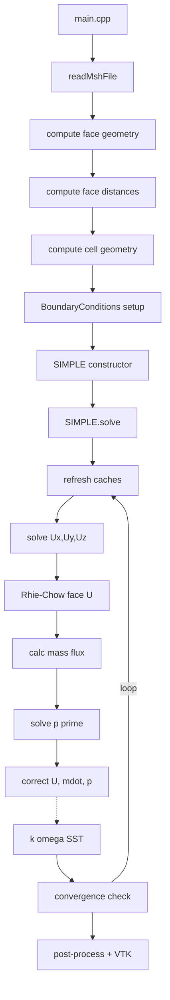

## Developer Guide

This document explains the internal architecture and implementation details of the CFD solver. It is intended for contributors and users who want to understand, extend, or debug the code.

### Table of contents
- Architecture overview
- Core data structures
- Mesh I/O and topology building
- Boundary conditions system
- Numerical schemes (gradients, convection, diffusion)
- Linear system assembly (`Matrix`)
- SIMPLE algorithm (pressure–velocity coupling)
- Rhie–Chow face-velocity interpolation
- Turbulence model (k–omega SST)
- Post-processing and VTK export
- Linear solvers
- Precision and numerical tolerances
- Extending the codebase (recipes)
- Debugging and tips

### Architecture overview (Current Structure)

**Headers (`include/`):**
- **`Core/`**: fundamental types and utilities
  - `Scalar.h`, `Vector.h`, `linearInterpolation.h`, `massFlowRate.h`
- **`Mesh/`**: geometry, fields, mesh I/O  
  - `Face.h`, `Cell.h`, `CellData.h`, `FaceData.h`, `MeshReader.h`, `checkMesh.h`
- **`BoundaryConditions/`**: patch metadata and physical BC configuration
  - `BoundaryPatch.h`, `BoundaryData.h`, `BoundaryConditions.h`
- **`Numerics/`**: discretization and algebraic system
  - `GradientScheme.h`, `ConvectionScheme.h`, `Matrix.h`, `LinearSolvers.h`, `SIMPLE.h`
- **`Models/`**: turbulence
  - `KOmegaSST.h`
- **`PostProcessing/`**: output
  - `VtkWriter.h`

**Sources (`src/`):**
- Corresponding `.cpp` implementations for all headers
- `main.cpp`: complete end-to-end example case (mesh path, BCs, schemes, solver controls, export)


## Core data structures

### Scalar precision
- `Scalar` is aliased to `double` by default via `PROJECT_USE_DOUBLE_PRECISION` (set in `CMakeLists.txt`).
- Switch to float by removing that definition. The program prints the mode via `SCALAR_MODE`.
- Global tolerances in `include/Core/Scalar.h` (e.g., `DIVISION_TOLERANCE`, `EQUALITY_TOLERANCE`, `AREA_TOLERANCE`, `VOLUME_TOLERANCE`, `GRADIENT_TOLERANCE`).

### Vector
- Simple 3D vector with arithmetic, `dot`, `cross`, `magnitude`, normalization, and stream IO.
- Used throughout for geometry (centroids, normals) and vector fields.

### Fields
- `CellData<T>`: typed cell-centered fields with bounds-checked access.
- `FaceData<T>`: typed face-centered fields.
- Type aliases:
  - `VectorField`, `ScalarField`, `VelocityField`, `PressureField`
  - `FaceFluxField` (Scalar), `FaceVectorField` (Vector)

### Mesh entities
- `Face`
  - Topology: `nodeIndices`, `ownerCell`, optional `neighbourCell` (boundary if empty).
  - Geometry computed in `calculateGeometricProperties(allNodes)`:
    - Triangles via cross product; polygons triangulated about the face center.
    - Fields: `centroid`, `normal` (unit), `area`, and integrals (`x2_integral`, ...).
  - Metric distances `calculateDistanceProperties(allCells)`:
    - `d_Pf`, `d_Nf` vectors and magnitudes; `e_Pf`, `e_Nf` unit vectors.
- `Cell`
  - Topology: lists of `faceIndices`, `neighbourCellIndices`, and `faceSigns` (outward normal convention).
  - `calculateGeometricProperties(allFaces)`:
    - Volume via divergence theorem: `V = (1/3) Σ (r_f · S_f)` using face integrals.
    - Centroid via second-moment accumulation.


## Mesh I/O and topology building

`MeshReader` reads Fluent `.msh` files (3D only):
- Sections: comments `(0)`, dimension `(2)`, nodes `(10)`, cells `(12)`, faces `(13)`, boundaries `(45)`.
- Fluent uses hexadecimal indices for declarations; helpers convert hex→dec robustly.
- Faces section returns owner and optional neighbor cell; neighbor absent implies boundary.
- Boundaries section maps `zoneID` to `BoundaryPatch` name/type via `mapFluentBCToEnum`.
- After reading:
  - Builds `Cell.faceIndices`, `Cell.faceSigns` (+1 owner, -1 neighbor), and unique `neighbourCellIndices`.
  - Validates: min faces per cell, min nodes per face; prints a summary.

Notes:
- 2D meshes are rejected early (`dimension == 2`).
- Errors throw `std::runtime_error` with descriptive messages.


## Boundary conditions system

### Architecture
**Classes**:
- `BoundaryPatch`: Mesh patch metadata (name, Fluent type, `zoneID`, first/last face indices)
- `BoundaryData`: Type-safe storage with robust value/gradient handling
- `BoundaryConditions`: Manager class with comprehensive BC operations

### BoundaryData Implementation
**Supported BC Types**:
- `FIXED_VALUE`: Dirichlet boundary conditions
- `FIXED_GRADIENT`: Neumann boundary conditions  
- `ZERO_GRADIENT`: Natural boundary conditions
- `NO_SLIP`: Special case for velocity (vector value = 0)

**Value Storage**:
- `BCValueType::SCALAR` or `BCValueType::VECTOR`
- Type-safe getters: `getFixedScalarValue()`, `getFixedScalarGradient()`
- Vector storage: `vectorValue`, `vectorGradient`

### BoundaryConditions Manager
**Data Structure**: `patchBoundaryData[patchName][fieldName] = BoundaryData`

**Key Features**:
1. **Fast Lookup**: Face-to-patch cache built on demand via `ensureFaceToPatchCacheBuilt()`
2. **Smart Field Mapping**: Automatic fallback from `U_x`/`U_y`/`U_z` to parent field `U`
3. **Robust Retrieval**: `getFieldBC()` with comprehensive error handling
4. **Boundary Value Calculation**: `calculateBoundaryFaceValue()` for scalars and vectors

**Vector Component Handling**:
```cpp
// Smart component extraction
if (fieldName == "U_x") boundaryValue = bc->vectorValue.x;
else if (fieldName == "U_y") boundaryValue = bc->vectorValue.y;
else if (fieldName == "U_z") boundaryValue = bc->vectorValue.z;
```

### BC Evaluation Logic
**Scalar Boundary Values**:
- **FIXED_VALUE**: `φ_f = φ_boundary`
- **ZERO_GRADIENT**: `φ_f = φ_owner`  
- **FIXED_GRADIENT**: `φ_f = φ_owner + gradient × d_n`
  where `d_n = dot(d_Pf, face_normal)`

**Vector Boundary Values**:
- **FIXED_VALUE**: `U_f = U_boundary`
- **NO_SLIP**: `U_f = (0, 0, 0)`
- **ZERO_GRADIENT**: `U_f = U_owner`
- **FIXED_GRADIENT**: `U_f = U_owner + gradient × d_n`

**Graceful Fallbacks**:
- Missing BC specifications default to zero-gradient
- Unknown field names default to cell gradient
- Invalid patches use cell values


## Numerical schemes

### Gradient reconstruction (`GradientScheme`)

#### Cell Gradient Computation (`CellGradient`)
**Method**: Weighted least-squares gradient reconstruction

**Algorithm**:
1. **Neighbor Analysis**: Validate neighbor cells and compute distance vectors
2. **Weight Calculation**: `w = 1/r²` for inverse-distance-squared weighting
3. **Matrix Assembly**: Form normal equations `ATA·∇φ = ATb`
   - `ATA = Σ w·(r ⊗ r)` (3×3 matrix)
   - `ATb = Σ w·Δφ·r` (3×1 vector)
4. **Regularization**: Add small diagonal term to prevent singularity
5. **Solution**: Eigen LLT decomposition with LU fallback
6. **Gradient Limiting**: Barth-Jesperson limiter prevents unphysical gradients

**Robustness Features**:
- **Dual solver**: LLT primary, LU fallback for poorly conditioned systems
- **Regularization**: `totalWeight × 1e-12` prevents singular matrices
- **Gradient limiting**: Prevents overshoots in high-gradient regions
- **Error handling**: Comprehensive validation and graceful failures

#### Face Gradient Computation (`FaceGradient`)
**Method**: Corrected interpolation of cell gradients

**Algorithm**:
1. **Boundary Check**: Use `calculateBoundaryFaceGradient()` for boundary faces
2. **Distance Calculation**: `d_PN = centroid_N - centroid_P`
3. **Average Gradient**: Distance-weighted interpolation via `averageFaceGradient()`
4. **Consistency Correction**: `correction = (φ_N - φ_P)/|d_PN| - (∇φ_avg · e_PN)`
5. **Final Result**: `∇φ_f = ∇φ_avg + correction × e_PN`

**Face Gradient Averaging (`averageFaceGradient`)**:
- **Weights**: `g_P = d_Nf/(d_Pf + d_Nf)`, `g_N = d_Pf/(d_Pf + d_Nf)`
- **Formula**: `∇φ_f = g_P × ∇φ_P + g_N × ∇φ_N`
- **Physical meaning**: Closer cell has more influence

#### Boundary Face Gradients (`calculateBoundaryFaceGradient`)
**Approach**: Normal/tangential decomposition

**FIXED_VALUE BC**:
1. Calculate normal gradient: `∂φ/∂n = (φ_boundary - φ_cell)/d_n`
2. Extract tangential components: `∇φ_tan = ∇φ_cell - (∇φ_cell·n)n`
3. Combine: `∇φ_f = ∇φ_tan + (∂φ/∂n)n`

**ZERO_GRADIENT BC**: `∇φ_f = ∇φ_cell`

**FIXED_GRADIENT BC**: 
1. Extract tangential: `∇φ_tan = ∇φ_cell - (∇φ_cell·n)n`
2. Apply normal gradient: `∇φ_f = ∇φ_tan + gradient_specified×n`

### Convection schemes (`ConvectionScheme`)

#### Upwind Differencing Scheme (UDS)
**Coefficients**: 
- `a_P_conv = max(massFlowRate, 0.0)`
- `a_N_conv = min(massFlowRate, 0.0)`

**Flow Direction Logic**:
- **Forward flow** (`mdot > 0`): Use owner cell value
- **Reverse flow** (`mdot < 0`): Use neighbor cell value
- **Sign handling**: `a_N_conv` correctly receives negative flow rates

**Properties**: First-order accurate, unconditionally stable

#### Central Difference Scheme (CDS)
**Implementation**: Deferred correction approach

**Matrix Coefficients**: Same as UDS for stability
**Correction Term**: `mdot × (φ_central - φ_upwind)`

**Face Value Calculation**:
```cpp
φ_f = φ_P × w + φ_N × (1-w) + (∇φ_f · d_Pf)
```
where `w = d_N/(d_P + d_N)` (inverse distance weighting)

**Features**:
- Second-order accurate on structured grids
- Requires face gradients for non-orthogonal correction
- Stable via deferred correction approach

#### Second-Order Upwind (SOU)
**Implementation**: Gradient-based extrapolation

**Face Value Calculation**:
```cpp
if (upwind_cell == owner)
    φ_f = φ_P + (∇φ_P · d_Pf)
else
    φ_f = φ_N + (∇φ_N · d_Nf)
```

**Correction Term**: `mdot × (φ_SOU - φ_UDS)`

**Properties**: Second-order accurate, bounded, TVD-like behavior

### Diffusion treatment
**Orthogonal Component**: Handled implicitly via `E_f = (S_f · e_PN) e_PN`
**Non-orthogonal Correction**: Explicit via `T_f = S_f - E_f` using face gradients
**Formula**: `∇φ_f · T_f` added to RHS for non-orthogonal meshes


## Linear system assembly (`Matrix`)

Holds cached gradients and face data per SIMPLE iteration:
- Cell gradients: `gradP`, `gradUx`, `gradUy`, `gradUz`, optionally `gradk`, `gradOmega`.
- Face gradients: `grad*_f` via interpolation.
- Face mass fluxes `mdotFaces` for consistent assembly.

### Momentum matrices (per component)
`buildMomentumMatrix(fieldName, φ, φ_old, source, ρ, Γ, timeScheme, dt, θ, grad_φ, grad_φ_f, conv)`:
- Steady-state path:
  - Assembles diffusion and convection for internal faces with non-orthogonal correction.
  - Boundary faces:
    - Dirichlet: contributes to diagonal and RHS using `computeDirichletValue` (handles vector-valued U components).
    - Neumann: adds to RHS for fixed-gradient; zero-gradient eliminates diffusive normal flux.
  - Deferred-correction for CDS/SOU added to RHS.
- Transient path: adds implicit diagonal `ρV/dt` and explicit old-state contributions as per θ-scheme.

### Pressure correction matrix
`buildPressureMatrix(massFlux, a_Ux, a_Uy, a_Uz, ρ)`:
- RHS is negative mass imbalance per cell.
- Coefficients derived from Rhie–Chow-consistent momentum diagonals `a_U*` and face metric/normals (minimum correction, with ρ).
- If no fixed-pressure BC exists, anchors p' at one cell to avoid singularity.

### Under-relaxation
`relax(α, φ_prev)` performs Patankar-style implicit relaxation by scaling the diagonal and adjusting RHS with the previous state.


## SIMPLE algorithm

Entry point: `SIMPLE::solve()` performs the outer iteration until convergence or `maxIterations`:
1) Cache refresh: gradients and `mdotFaces` for the current iteration.
2) Solve momentum equations for `U_x`, `U_y`, `U_z` with effective viscosity `μ_eff = μ + μ_t` (if turbulence enabled).
3) Compute Rhie–Chow face velocities and mass fluxes from updated U.
4) Build and solve pressure correction p'.
5) Correct velocity with `U = U* - (1/a_rep) ∇p'` (a representative diag per cell).
6) Correct face mass fluxes and pressure `p = p + α_p p'`; reset p'.
7) If enabled, advance k–ω SST using current fields and gradients.
8) Check convergence using mass imbalance, velocity RMS, and p' RMS; warn on divergence.

Controls:
- `setRelaxationFactors(α_U, α_p)`, `setConvergenceTolerance(tol)`, `setMaxIterations(n)`, `enableTurbulenceModeling(bool)`.


## Rhie–Chow face-velocity interpolation

Used in `calculateRhieChowFaceVelocities()` to prevent pressure checkerboarding:
- Start with linear-interpolated face velocity `U_f_lin`.
- Compute face D-like coefficient from interpolated momentum diagonals and geometry.
- Apply correction with face pressure gradient: `U_f = U_f_lin + D_f (∇p_f_lin - ∇p_f_cache)`.
- Add previous-iteration face under-relaxation term `(1-α_U)(U_f_prev - U_f_lin_prev)`.
- Boundary faces use centralized BC evaluation.


## Turbulence model (k–omega SST)

Class `KOmegaSST`:
- Initializes `k`, `ω`, `μ_t`, and computes `wallDistance` by solving a Poisson-like equation with `φ=0` at walls and `∇²φ=-1`.
- Solves ω and k transport with variable diffusion (`μ + σ·μ_t`), production/destruction, and cross-diffusion for SST.
- Calculates blending functions `F1`/`F2`, turbulent viscosity `μ_t = ρ a1 k / max(a1 ω, S F2)`, and applies wall corrections.
- Provides getters used by SIMPLE to form `μ_eff` and for post-processing: `k`, `ω`, `μ_t`, `wallDistance`, `wallShearStress`.
- Supports transient mode (`setTransientMode`), though main driver currently uses steady flow.


## Post-processing and VTK export

`VtkWriter::writeVtkFile(filename, allNodes, allFaces, allCells, scalarCellFields)`:
- Writes VTK PolyData (`.vtp`) with points and polygonal faces.
- Maps cell-centered scalar fields to faces via owner-cell index.
- Used in `main.cpp` to export pressure, velocity magnitude and components, and when available: `k`, `ω`, `μ_t`, `wallDistance`, and derived quantities (`turbulentIntensity`, `turbulentViscosityRatio`, `yPlus`).


## Linear solvers

`LinearSolvers::BiCGSTAB` wraps Eigen’s BiCGSTAB with ILUT preconditioning:
- Configurable max iterations and tolerance per solve call.
- Logs iteration counts, estimated error, and exact final residual norms (L2 and avg abs).
- Throws on non-finite errors; returns success boolean.


## Precision and numerical tolerances

- Precision selected at compile time via `PROJECT_USE_DOUBLE_PRECISION`.
- Tolerance constants adapt to `Scalar` (e.g., comparisons, divisions, gradient detection).
- Many algorithms include small epsilons to guard against degeneracy.


## Extending the codebase (recipes)

### Add a new scalar transport equation
1) Create a `ScalarField phi("phi", numCells, initial)` in your driver.
2) Build an effective diffusion field `Gamma` and a source `phi_source` per cell.
3) Use `Matrix::buildScalarTransportMatrix("phi", phi, phi_old, U, phi_source, rho, Gamma, TimeScheme::Steady, 0.0, 1.0, convScheme)`.
4) Solve with `LinearSolvers::BiCGSTAB`, copy solution back to `phi`.
5) Apply boundary conditions if needed via `BoundaryConditions`.

### Add a new convection scheme
1) Derive from `ConvectionScheme` and implement `getFluxCoefficients`.
2) Optionally add high-order face value and correction methods (see CDS/SOU) and integrate as deferred-correction in `Matrix`.

### Add a new boundary condition
1) **Extend enums**: Add new type to `BCType` enum
2) **Update BoundaryData**: Add setters/getters for new BC type
3) **Extend evaluation**: Update `calculateBoundaryFaceValue()` and `calculateBoundaryFaceGradient()`
4) **Matrix integration**: Update boundary handling in `Matrix::buildMomentumMatrix()`
5) **Testing**: Add comprehensive test cases for the new BC type

**Example Implementation**:
```cpp
// 1. Add to BCType enum
PERIODIC,  // New BC type

// 2. Add BoundaryData methods
void setPeriodicValue(Scalar offset) {
    type = BCType::PERIODIC;
    scalarValue = offset;
}

// 3. Update evaluation logic
case BCType::PERIODIC:
    return calculatePeriodicValue(face, phi, bc->scalarValue);
```

### Expose fluid properties as inputs
- Add setters on `SIMPLE` for `rho` and `mu`, thread through to `Matrix` and `KOmegaSST` calls as needed.


## Testing and Debugging

### Comprehensive Testing Methodology

#### Boundary Conditions Testing
**Testing Strategy**: Add comprehensive std::cout debugging to trace:
1. **Patch Registration**: Verify patch names, zones, face ranges
2. **BC Storage**: Confirm type-safe storage of scalar/vector values
3. **Field Lookup**: Test `getFieldBC()` with various field names
4. **Vector Components**: Verify `U_x`/`U_y`/`U_z` → `U` fallback
5. **Boundary Values**: Test `calculateBoundaryFaceValue()` for all BC types
6. **Cache Operations**: Verify face-to-patch mapping performance

**Key Tests**:
```cpp
// Test all BC types
setFixedValue("inlet", "U", Vector(1,0,0));
setZeroGradient("outlet", "p");
setNoSlip("wall", "U");
setFixedGradient("interface", "T", 100.0);
```

#### Convection Schemes Testing
**Testing Strategy**: Verify coefficient calculation and face values:
1. **Coefficient Logic**: Test `getFluxCoefficients()` for +/- mass flow rates
2. **Flow Direction**: Verify upwind cell selection
3. **Face Values**: Test interpolation and extrapolation methods
4. **Correction Terms**: Verify deferred correction calculations
5. **Boundary Integration**: Test BC application in schemes

**Critical Tests**:
```cpp
// Test flow direction handling
massFlowRate = +1.0: a_P_conv = 1.0, a_N_conv = 0.0  // Owner→Neighbor
massFlowRate = -1.0: a_P_conv = 0.0, a_N_conv = -1.0 // Neighbor→Owner
```

#### Gradient Schemes Testing
**Testing Strategy**: Verify mathematical correctness:
1. **Neighbor Validation**: Check distance calculations and weighting
2. **Matrix Assembly**: Verify ATA matrix conditioning and determinant
3. **Solver Robustness**: Test LLT/LU fallback mechanisms
4. **Gradient Limiting**: Verify limiter activation in high-gradient regions
5. **Face Interpolation**: Test averaging weights and corrections
6. **Boundary Gradients**: Verify normal/tangential decomposition

**Matrix Verification**:
```cpp
// Check matrix properties
ATA.determinant() > 0  // Well-conditioned system
regularization = totalWeight × 1e-12  // Prevents singularity
gradMag * maxDistance < 10.0 * phiRange  // Gradient limiting
```

### Debugging Strategies

#### Adding Debug Output
1. **Method Tracing**: Add entry/exit logging for key methods
2. **Parameter Logging**: Log input parameters and intermediate calculations
3. **Validation Checks**: Add assertions for mathematical consistency
4. **Performance Monitoring**: Track solver iterations and convergence

#### Common Issues and Solutions

**Boundary Condition Issues**:
- **Symptom**: "No BC specified" warnings
- **Solution**: Check patch names match mesh exactly
- **Debug**: Use `printSummary()` to list all patches and BCs

**Convection Scheme Issues**:
- **Symptom**: Incorrect flow direction or instability
- **Solution**: Verify mass flow rate signs and upwind logic
- **Debug**: Log `massFlowRate`, `a_P_conv`, `a_N_conv` values

**Gradient Issues**:
- **Symptom**: "Gradient computation failed" errors
- **Solution**: Check mesh quality and neighbor connectivity
- **Debug**: Log ATA matrix condition number and rank

#### Best Practices
1. **Modular Testing**: Test individual components before integration
2. **Mathematical Verification**: Verify algorithms against literature
3. **Boundary Case Testing**: Test with extreme parameter values
4. **Performance Profiling**: Monitor computational efficiency
5. **Regression Testing**: Maintain test cases for future validation

### Development Tips

- **BCs**: Use `BoundaryConditions::printSummary()` to inspect setup
- **Gradients**: Check matrix conditioning with `ATA.determinant()`
- **Convection**: Verify upwind logic with simple 1D test cases  
- **Solver logs**: High residuals indicate BC or relaxation issues
- **Mesh validation**: Reader throws early for malformed `.msh` files
- **ParaView**: PolyData cells are faces; color by face arrays
- **Debugging**: Use comprehensive std::cout for method tracing


## Call flow




