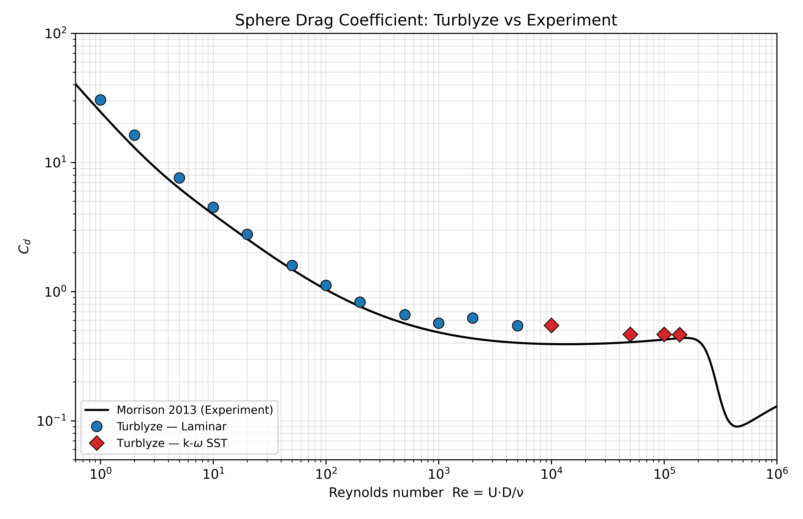

# Validation — Sphere Drag Curve

This folder validates Turblyze against the Morrison (2013) smooth-sphere drag
correlation.

The validation figure separates two regimes:

- laminar low-Re with turbulence disabled
- subcritical k-omega SST benchmark points

## Figure



## Data

| Series | File |
|---|---|
| Laminar | `results/laminarCasesResults.csv` |
| Subcritical SST points | `results/turbulentCasesResults.csv` |
| Reference correlation | `reference/morrison2013.py` |

## Reproduce

```bash
python3 validation/scripts/plotDragCurve.py
```

The plot script requires `numpy` and `matplotlib`.
